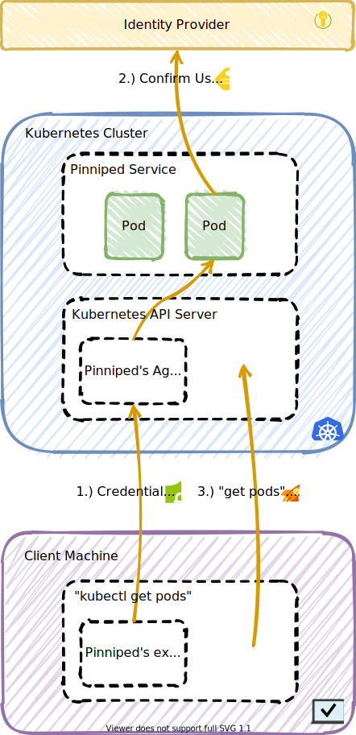

# Architecture

The principal purpose of Pinniped is to allow users to access Kubernetes
clusters. Pinniped hopes to enable this access across a wide range of Kubernetes
environments with zero configuration.

This integration is implemented using a credential exchange API which takes as
input a credential from the external IDP and returns a credential which is understood by the host
Kubernetes cluster.

Pinniped supports various IDP types and implements different integration strategies
for various Kubernetes distributions to make authentication possible.

## Supported Kubernetes Cluster Types

Pinniped supports the following types of Kubernetes clusters:

- Clusters where the Kube Controller Manager pod is accessible from Pinniped's pods.

Support for other types of Kubernetes distributions is coming soon.

## External Identity Provider Integrations

Pinniped will consume identity from one or more external identity providers
(IDPs). Administrators will configure external IDPs via Kubernetes custom
resources allowing Pinniped to be managed using GitOps and standard Kubernetes tools.

Pinniped supports the following external IDP types.

1. Any webhook which implements the
   [Kubernetes TokenReview API](https://kubernetes.io/docs/reference/access-authn-authz/authentication/#webhook-token-authentication).

   In addition to allowing the integration of any existing IDP which implements this API, webhooks also
   serve as an extension point for Pinniped by allowing for integration of arbitrary custom authenticators.
   While a custom implementation may be in any language or framework, this project provides a
   sample implementation in Golang. See the `ServeHTTP` method of
   [cmd/local-user-authenticator/main.go](../cmd/local-user-authenticator/main.go).

More IDP types are coming soon.

## Cluster Integration Strategies

Pinniped will issue a cluster credential by leveraging cluster-specific
functionality.  In the near term, cluster integrations will happen via different
cluster-specific flows depending on the type of cluster. In the longer term,
Pinniped hopes to contribute and leverage upstream Kubernetes extension points that
cleanly enable this integration.

Pinniped supports the following cluster integration strategies.

1. Pinniped hosts a credential exchange API endpoint via a Kubernetes aggregated API server.
This API returns a new cluster-specific credential using the cluster's signing keypair to
issue short-lived cluster certificates. (In the future, when the Kubernetes CSR API
provides a way to issue short-lived certificates, then the Pinniped credential exchange API
will use that instead of using the cluster's signing keypair.)

More cluster integration strategies are coming soon, which will allow Pinniped to
support more Kubernetes cluster types.

## `kubectl` Integration

With any of the above IDPs and integration strategies, `kubectl` commands receive the
cluster-specific credential via a
[Kubernetes client-go credential plugin](https://kubernetes.io/docs/reference/access-authn-authz/authentication/#client-go-credential-plugins).
Users may use the Pinniped CLI as the credential plugin, or they may use any proprietary CLI
built with the [Pinniped Go client library](../generated).

## Example Cluster Authentication Sequence Diagram

This diagram demonstrates using `kubectl get pods` with the Pinniped CLI configured as the credential plugin,
and with a webhook IDP configured as the identity provider for the Pinniped server.

