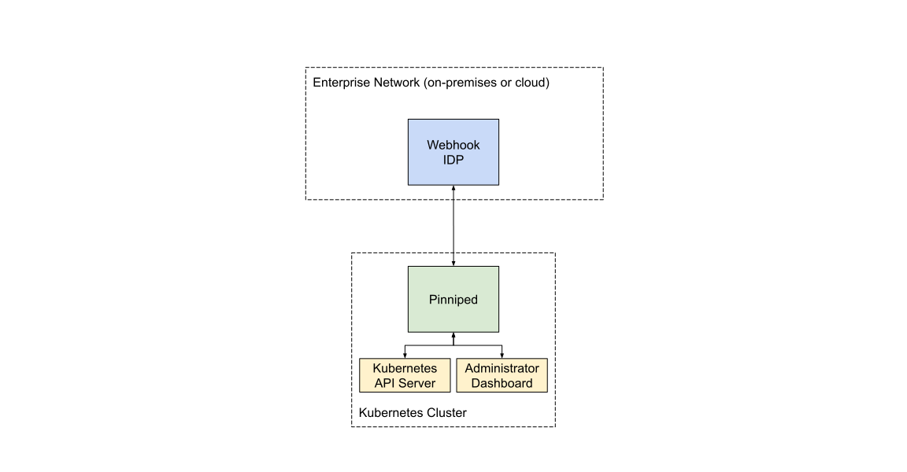

# Architecture

The principal purpose of Pinniped is to allow users to access Kubernetes
clusters. Pinniped hopes to enable this access across a wide range of Kubernetes
environments with zero configuration.

This integration is implemented using a credential exchange API which takes as
input a credential from the external IDP (or internal federation trust
relationship) and returns a credential which is understood by the host
Kubernetes cluster. To learn more about this integration, see [Cluster
Integration Strategies](#cluster-integration-strategies).

## External Identity Provider Integrations

Pinniped will consume identity from one or more external identity providers
(IDPs). Administrators will configure external IDPs via [Kubernetes custom
resources](https://kubernetes.io/docs/concepts/extend-kubernetes/api-extension/custom-resources/),
allowing Pinniped to be managed using GitOps and standard Kubernetes tools.

IDP integration support will be driven by empirical use case.

IDPs that support only just-in-time flows (such as OIDC) can be optionally
paired with a separate directory backend to enable directory-based flows such as
first-class support for policy editing UX.

### Supported External Identity Provider Types

The currently supported external IDP types are outlined here. More will be added
in the future.

1. Any webhook which implements the
[Kubernetes TokenReview API](https://kubernetes.io/docs/reference/access-authn-authz/authentication/#webhook-token-authentication)

## Cluster Integration Strategies

Pinniped will issue a cluster credential by leveraging cluster-specific
functionality.  In the near term, cluster integrations will happen via different
cluster-specific flows depending on the type of cluster. In the longer term,
Pinniped hopes to contribute and leverage upstream Kubernetes extension points that
cleanly enable this integration.

### Supported Cluster Integration Strategies

The currently supported cluster integration strategies are outlined here. More
will be added in the future.

1. Pinniped hosts a credential exchange API endpoint via a Kubernetes aggregated API server.
This API returns a new cluster-specific credential using the cluster's signing keypair to
issue short-lived cluster certificates. (In the future, when the Kubernetes CSR API
provides a way to issue short-lived certificates, then the Pinniped credential exchange API
will use that instead of using the cluster's signing keypair.)

## `kubectl` Integration

With any of the above IDPs and integration strategies, `kubectl` commands receive the
cluster-specific credential via a
[Kubernetes client-go credential plugin](https://kubernetes.io/docs/reference/access-authn-authz/authentication/#client-go-credential-plugins).
Users may use the Pinniped CLI as the credential plugin, or they may use any proprietary CLI
built with the [Pinniped Go client library](generated).

## Example Cluster Authentication Sequence Diagram

## Example Deployment Architecture

